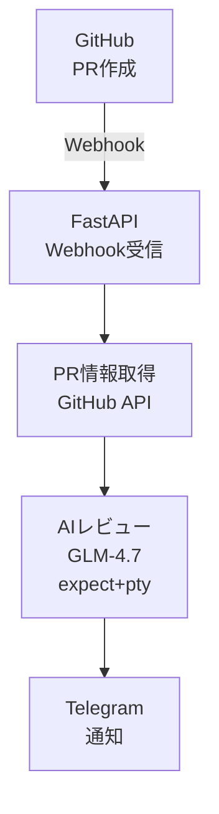

# Agent-OSでGitHub PRの自動レビューを構築した話

## はじめに

コードレビューは重要だけど、毎回手動で行うのは時間がかかります。そこで、**GitHub PRが作成されたらAIが自動でレビューし、結果をTelegramに通知する仕組み**をAgent-OS上に構築しました。

本記事では、その構成と技術的なポイントを紹介します。

---

## 構成図



---

## 技術ポイント

### 1. Webhook受信（FastAPI + ngrok）

GitHub Webhookはインターネットからアクセス可能なURLが必要です。ローカル開発環境では**ngrok**を使用して一時的な公開URLを取得します。

```python
from fastapi import FastAPI, Request

app = FastAPI()

@app.post("/webhook/github")
async def github_webhook(request: Request):
    payload = await request.json()
    # PR情報を抽出して処理
    await process_pr(payload)
```

**ngrokの自動更新対策**

無料版ngrokは起動ごとにURLが変わるため、GitHub Webhook設定を自動更新するスクリプトを作成しました：

```bash
#!/bin/bash
# update_webhook_url.sh

NGROK_URL=$(curl -s http://localhost:4040/api/tunnels | jq -r '.tunnels[0].public_url')
# GitHub APIでWebhook URLを更新
curl -X PATCH \
  -H "Authorization: token $GITHUB_TOKEN" \
  -H "Accept: application/vnd.github.v3+json" \
  -d "{\"config\":{\"url\":\"$NGROK_URL/webhook/github\"}}" \
  "https://api.github.com/repos/$REPO/hooks/$HOOK_ID"
```

### 2. AIレビュー（OpenClaw CLI + expect）

AIモデルには**GLM-4.7**（Zhipu AI）を使用しています。当初は`subprocess.run()`でOpenClaw CLIを呼び出していましたが、**TTYがないとCLIがタイムアウトする問題**が発生しました。

**解決策：expectコマンド**

```python
import pexpect

child = pexpect.spawn(
    "openclaw infer model run --model zai/glm-4.7 --local",
    timeout=180
)
child.sendline(prompt)
child.expect(pexpect.EOF)
output = child.before.decode('utf-8')
```

`pexpect`ライブラリを使用することで、疑似端末（PTY）を確保し、OpenClaw CLIが正常に動作するようになりました。

### 3. システム化（systemd）

開発用PCで常時動作させるため、**systemdサービス**として登録しました：

```ini
# /etc/systemd/system/pr-review-webhook.service
[Unit]
Description=GitHub PR Auto Review Webhook
After=network.target

[Service]
Type=simple
User=milky
WorkingDirectory=/home/milky/agent-os/webhook_taskflow
Environment=GITHUB_TOKEN=ghp_xxx
Environment=ZHIPU_API_KEY=xxx
Environment=TELEGRAM_BOT_TOKEN=xxx
Environment=TELEGRAM_CHAT_ID=xxx
ExecStart=/usr/bin/python3 /home/milky/agent-os/webhook_taskflow/listener.py
Restart=always
RestartSec=10

[Install]
WantedBy=multi-user.target
```

有効化コマンド：
```bash
sudo systemctl enable pr-review-webhook
sudo systemctl start pr-review-webhook
```

### 4. 通知（Telegram Bot）

レビュー結果を**Telegram Bot**で通知。MISO（Mission Control）と連携して、Agent-OSのダッシュボードにも表示されます。

```python
import requests

def send_telegram(message: str):
    url = f"https://api.telegram.org/bot{TELEGRAM_BOT_TOKEN}/sendMessage"
    requests.post(url, json={
        "chat_id": TELEGRAM_CHAT_ID,
        "text": message,
        "parse_mode": "Markdown"
    })
```

---

## 結果

構築後、PR作成からレビュー通知までの**所要時間は約30〜60秒**に短縮されました。

**実際の通知例：**

```
🤖 PR自動レビュー結果

📁 taka3693/-agent-os #122
📝 Add webhook test comment in README.md
👤 taka3693

📝 レビュー:
✅ README.mdの変更は適切
⚠️ コメント内容が短すぎる可能性
💡 より詳細な説明を追加推奨

🔗 https://github.com/taka3693/-agent-os/pull/122
```

**課題も残りました：**
- AIレビューは参考程度（人間のレビューが必要）
- 大きなPRだとdiffが長くて処理に時間がかかる
- ngrokの無料版は接続数に制限あり

---

## まとめ

Agent-OS + OpenClaw + FastAPI + systemdの組み合わせで、**ローカル環境から運用可能なPR自動レビューシステム**を構築しました。

**キーポイント：**
1. **Webhook受信** → FastAPI + ngrokで実現
2. **AI処理** → expect/ptyでTTY問題を解決
3. **常時運用** → systemdサービス化
4. **通知** → Telegram Botで即座に確認

この仕組みは、個人開発や小規模チームでのコード品質向上に役立ちます。ぜひ参考にしてみてください。

---

## 参考リンク

- [OpenClaw ドキュメント](https://docs.openclaw.ai)
- [FastAPI Webhook ガイド](https://fastapi.tiangolo.com)
- [pexpect ドキュメント](https://pexpect.readthedocs.io)

---

*本記事はAgent-OS上でGLM-4.7を使用して作成されました。*

